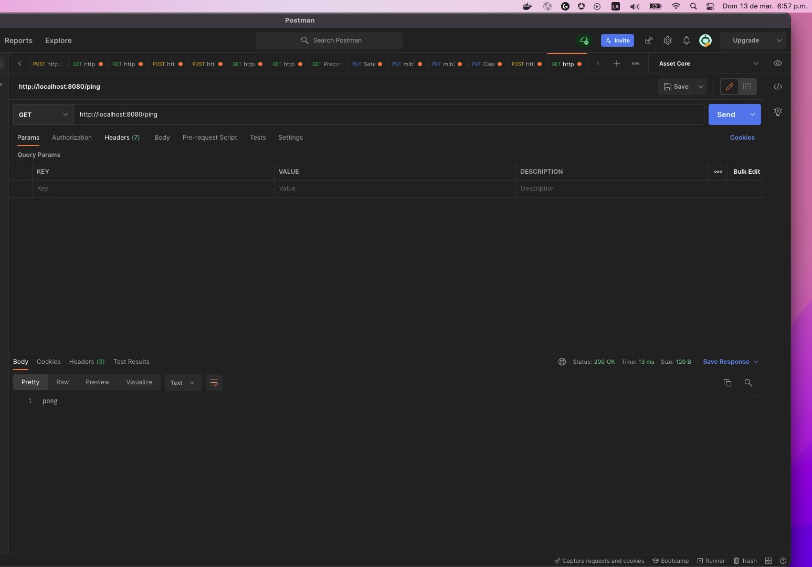
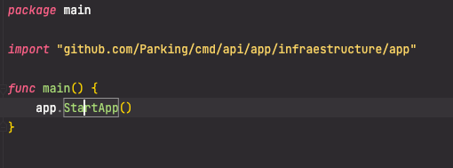
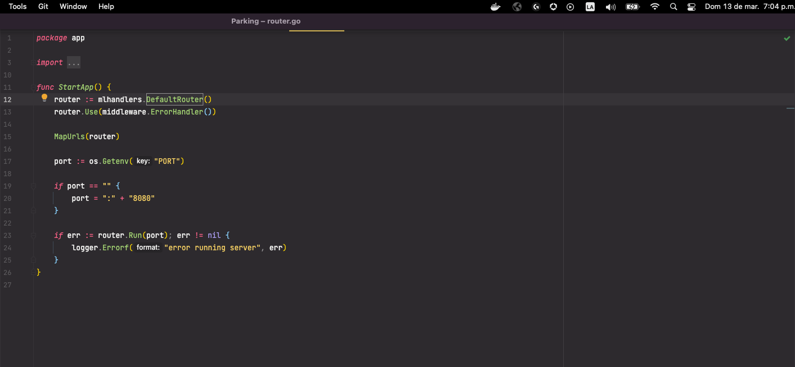
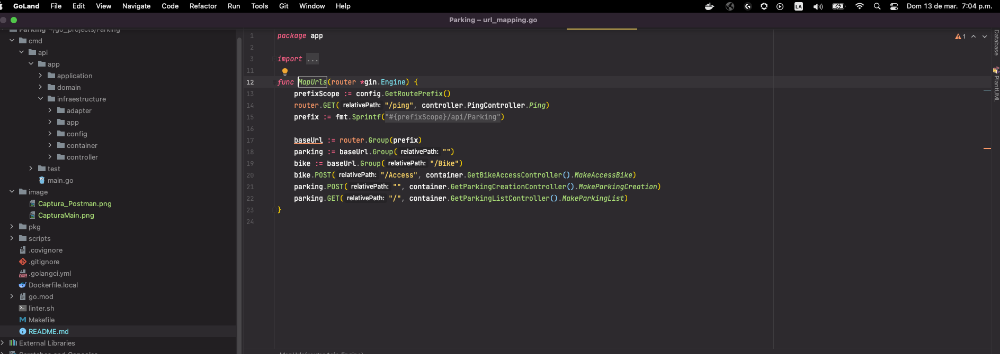
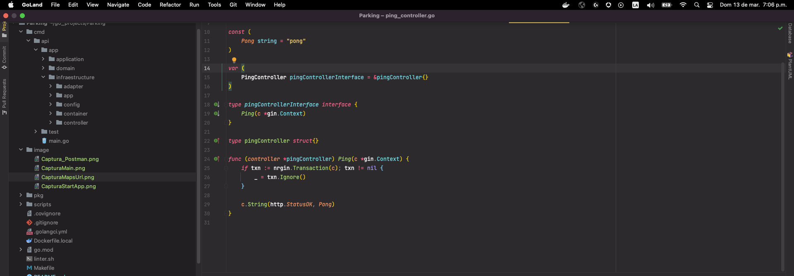

# Parking for Bikes GO Hexagonal Architecture

This is a basic Go application created using hexagon architecture  and golang 

## First steps

##Go Runtime Version

Specify the Go runtime version tag you desire in your `Dockerfile`. If in doubt, it's completely safe to always use the
latest one given the [Go 1 compatibility guarantees](https://golang.org/doc/go1compat).

### Release Process Support

Set the application module name in the first line of the `go.mod` file with your application's GitHub repository URL.
Avoiding to do so will result in the CI process, and go command failing.

The file should start with:

### Dependency management

This** image has native support for Go Modules and requires the use of it as the dependency management tool.

##Examples to the work flow with post man and  code example

In this section you can find the images  of workflow for the ping endpoint:

Postman capture:

##Code Flow:

Main:

StartApp:

MapsURL:

Ping Controller:

